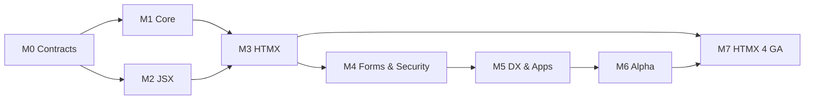

# Model

Every issue has a stable `GH-NNN` ID and explicit `depends_on` metadata. The generated graph is validated as acyclic. GitHub issue numbers are secondary and may differ across repositories.

# Recommended waves

# Within a milestone

Use the issue index and `github/bulk-issue-creation.md` for topological order. Multiple ready issues may run in parallel, but no agent may assume an unmerged dependency contract.

# Blocking policy

Mark a GitHub issue `status:blocked` when a dependency, upstream release, or decision is unresolved. Do not “complete around” a blocker by introducing an undocumented alternative.
